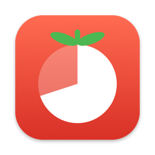

<p align="center">
  
</p>

<h1 align="center">PomodoroBar</h1>

<p align="center">
  A tiny, native Pomodoro timer that lives in your Mac's menu bar.<br>
  Pure Swift + AppKit · no dependencies · ~12 MB RAM · 0% CPU when idle
</p>

---

## Features

- **Menu bar countdown** with a progress icon: a pie for focus, a ring for breaks. The icon dims when paused.
- **Full Pomodoro cycle**: focus → short break, and a long break after every N sessions.
- **Start / Pause / Resume / Reset / Skip** from the menu, or press **⌃⌥P** anywhere to start or pause.
- **Notifications** when a phase ends, with a one-click **Start Break / Start Focus** button.
- **Optional sounds**, plus auto-start for breaks and for focus sessions.
- **Today's stats**: pomodoros completed and total focus time. These reset at midnight.
- **Adjustable lengths**: presets or any custom length (1–180 min).
- **Launch at Login**, a toggle for showing the time in the menu bar, and no Dock icon.
- All settings are saved between launches.

## Install

### Download

1. Download `PomodoroBar-x.y.zip` from the [latest release](../../releases/latest), unzip it, and move **PomodoroBar.app** to **Applications**.
2. The app isn't notarized by Apple, so macOS blocks the first launch. To allow it, either:
   - Open it once, then go to **System Settings → Privacy & Security** and click **Open Anyway**, or
   - Run this in Terminal:
     ```bash
     xattr -dr com.apple.quarantine /Applications/PomodoroBar.app
     ```
3. Allow notifications when asked. Optionally, turn on **Launch at Login** from the menu.

### Build from source

Requires macOS 13+ and Xcode or its command-line tools (Swift 5.9+).

```bash
git clone https://github.com/ayushpandeyy007/PomodoroBar.git
cd PomodoroBar
./build.sh install    # builds, copies to /Applications, launches
```

Other options: `./build.sh` only builds into `build/`, and `./build.sh release` also creates a zip for distribution.

To uninstall: choose **Quit PomodoroBar** from the menu, then delete `/Applications/PomodoroBar.app`.

## Efficiency

- Uses **0% CPU when idle**: no timer runs unless a session is active.
- While a session runs it wakes **once per second**, timed to the moment the displayed second changes. It keeps working while the menu is open.
- The time is worked out from the session's end time, so it **stays accurate through sleep** and doesn't drift.
- The menu bar is only redrawn when something visible changes. The icon has 60 steps, so it redraws about every 25 s during a 25-min session.
- About **12 MB** of memory and a ~330 KB universal binary (Apple Silicon + Intel).

## Project layout

| File | Purpose |
| --- | --- |
| `Sources/PomodoroEngine.swift` | Timer state machine (phases, cycle, ticking, sleep resync) |
| `Sources/AppDelegate.swift` | Status item, menu, actions |
| `Sources/StatusIcon.swift` | Template icon drawing + time formatting |
| `Sources/Settings.swift` | UserDefaults-backed settings and daily stats |
| `Sources/Notifier.swift` | User notifications with "Start" actions |
| `Sources/HotKey.swift` | Global ⌃⌥P shortcut (Carbon; needs no Accessibility permission) |
| `scripts/make_icon.swift` | Renders the app icon |
| `build.sh` | Compiles a universal, ad-hoc signed `.app` bundle |
